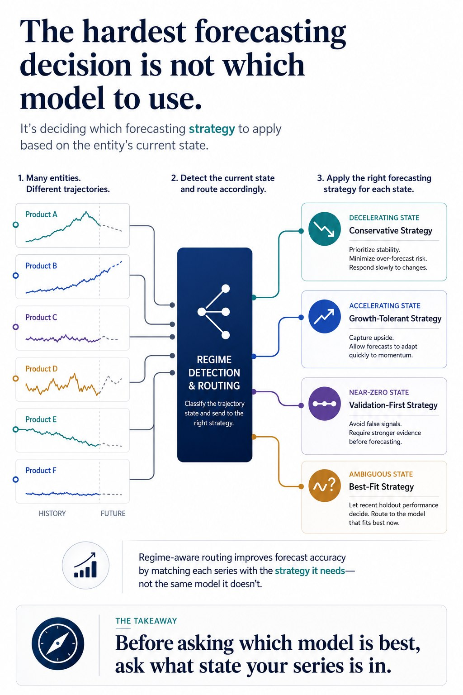

# Forecasting Routing Layer

A regime-aware forecasting project showing how multi-entity time series can be routed to different forecasting strategies before model selection.

## Project Website

[View Project Site](https://mah-trigui.github.io/forecasting-routing-layer/)

## Overview

This project forecasts cumulative COVID-19 deaths across roughly 180 countries using a trajectory-aware pipeline.

Instead of applying one global forecasting strategy to all countries, the system first computes recent trajectory signals, classifies each country into a regime, and routes it to a different forecasting strategy.

## Core Modeling Pattern

Before asking:
- which model is best

the pipeline first asks:
- what type of series is this entity currently presenting?

This turns forecasting into a two-stage architecture:
1. regime detection
2. regime-specific forecasting

## Architecture



<details>
<summary>📋 View detailed text-based architecture diagram</summary>

```text
                ┌─────────────────────────────────────────────┐
                │ Multi-Entity Time Series Input             │
                │ country-level cumulative & daily deaths    │
                └──────────────────────┬──────────────────────┘
                                       │
                                       ▼
                ┌─────────────────────────────────────────────┐
                │ Data Cleaning / Preprocessing              │
                │ - negative corrections -> 0                │
                │ - trim leading zeros                       │
                │ - fix repeated / missing reporting         │
                │ - smooth abnormal spikes                   │
                └──────────────────────┬──────────────────────┘
                                       │
                                       ▼
                ┌─────────────────────────────────────────────┐
                │ Trajectory Signal Layer                    │
                │ - elasticity from daily-death change       │
                │ - 10-day evolution summary                 │
                │ - 6-day recent evolution summary           │
                └──────────────────────┬──────────────────────┘
                                       │
                                       ▼
                ┌─────────────────────────────────────────────┐
                │ Regime Detection / Routing                 │
                │  DOWN | UP | NEAR_ZERO | REST             │
                └───────┬──────────────┬──────────────┬──────┘
                        │              │              │
                        ▼              ▼              ▼
          ┌──────────────────┐ ┌──────────────────┐ ┌────────────────────┐
          │ DOWN Strategy    │ │ UP Strategy      │ │ NEAR_ZERO Strategy │
          │ damped /         │ │ growth-tolerant  │ │ simple models +    │
          │ conservative     │ │ median selection │ │ short validation   │
          └────────┬─────────┘ └────────┬─────────┘ └─────────┬──────────┘
                   │                    │                     │
                   └──────────────┬─────┴──────────────┬──────┘
                                  ▼                    ▼
                       ┌─────────────────────────────────────┐
                       │ REST Strategy                       │
                       │ held-out validation across          │
                       │ ETS / ARIMA / TBATS variants        │
                       └────────────────┬────────────────────┘
                                        │
                                        ▼
                       ┌─────────────────────────────────────┐
                       │ Final Country Forecasts             │
                       │ merged into submission pipeline     │
                       └─────────────────────────────────────┘
